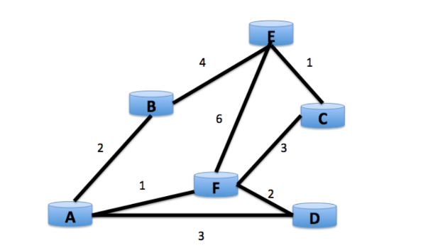

## Some useful qmicli commands



To use the following commands ensure qmicli and udhcpc are installed:

```bash
apt update && apt install libqmi-utils udhcpc
```

Check the device power status:

```bash
QMI_DEV=/dev/cdc_wdm0
qmicli -d "$QMI_DEV" --dms-get-operating-mode
```

Turn off the quectel:

```bash
qmicli -d "$QMI_DEV" --dms-set-operating-mode=low-power
```

Turn on the quectel:

```bash
qmicli -d "$QMI_DEV" --dms-set-operating-mode=online
```

Setting the iface to raw IP mode (required for network connection):

```bash
WWAN_IF=wwan0
sudo ip link set "$WWAN_IF" down
echo Y | sudo tee /sys/class/net/"$WWAN_IF"/qmi/raw_ip
sudo ip link set "$WWAN_IF" up
```

Get registration status:

```bash
qmicli -d "$QMI_DEV" --nas-get-serving-system
```

Start network with IPv4:

```bash
qmicli -d "$QMI_DEV" --wds-start-network="apn=internet,ip-type=4" --client-no-release-cid
```

Check network status:

```bash
qmicli -d "$QMI_DEV" --wds-get-packet-service-status
```

Enable traffic over network:

```bash
udhcpc -i "$WWAN_IF" -q -n
```

## How to fix drivers using serial commands

The open the serial console use:

```bash
sudo picocom -b 115200 /dev/ttyUSB3
```

replace the device name with the quectel serial dev

`+CFUN=1,1` - This restarts the Quectel
`AT+QCFG=\"usbnet\",0` - This sets the driver to qmi_wwan. 1 means MBIM

For more serial commands consult the Quectel documentation of your model

## How to enable Quectel in a docker EVM

Get the PID of the running docker container:

```bash
docker inspect --format '{{.State.Pid}}' name/id
```

Make sure the wwan0 is down (assuming wwan0 is the iface of quectel):

```bash
sudo ifconfig wwan0 down
```

Change interface network namespace:

```bash
ip link set wwan0 netns <docker-pid>
```

Finally ensure /dev/bus/usb is passed to the container

## How to blacklist Quectel from ModemManager

First get the vendor and product ID:

```bash
udevadm info -a -n /dev/ttyUSB0 | grep '{idVendor}' -m1
udevadm info -a -n /dev/ttyUSB0 | grep '{idProduct}' -m1
```

The vendor ID should be 7c2c

Next make or edit the following file

```bash
/etc/udev/rules.d/99-mm-blacklist.rules
```

Add these lines to the file:

```bash
ATTRS{idVendor}=="<vendor-id>", ATTRS{idProduct}=="<product-id>", ENV{ID_MM_DEVICE_IGNORE}="1"
```

Next reload the rules:

```bash
sudo udevadm control --reload-rules
sudo udevadm trigger
```

Finally restart ModemManager to apply changes:

```bash
sudo systemctl restart ModemManager
```

Verify that the device is not loaded into ModemManager like so:

```bash
mmcli -L
```

<embed src="../../file.pdf" type="application/pdf" width="100%" height="600px" />
