# SBS Design

# The PCB is done in mm (not mil)

If the LDO driving AVCC0 turns off, what happens for the ADC input pins?

## MCU Connections

## System control

- MD (operating mode control): P201 (26)
  - This pin must be set before releasing reset (RES) and held constant for the duration of the MCU's uptime or until the next assertion of RES.

| Mode-setting pin |                  |
|------------------|------------------|
| MD               | Operating mode   |
| 1                | Single-chip mode |
| 0                | SCI boot mode    |

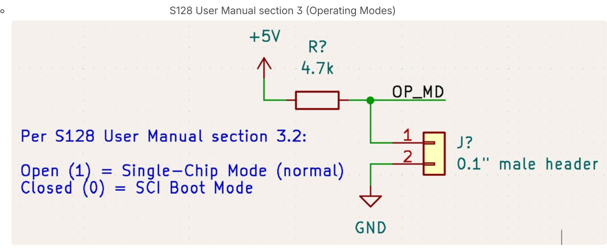

An onboard 0.1" header will be used to let the user add a jumper in case SCI booting is desired

- RES (active low reset): (5)
  - The S128 User Manual discusses an internal power-on reset in section 5.3.2.
  - The DK-S128 also lacks a power on reset circuit.

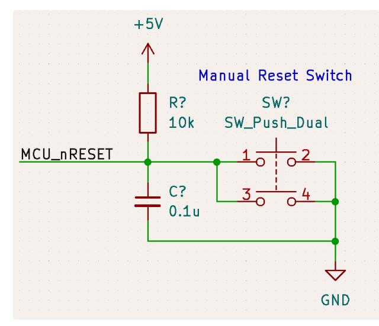

A manual reset switch can be optionally populated

The 9-pin JTAG port is also linked to the MCU\_nRESET net

#### Power

#### S128 datasheet Table 2.1

- VCC and VSS need 0.1 uF caps between each pair of these pins
- VCL connected to VSS through a 4.7-uF capacitor
- AVCC0 and AVSS0 need a 0.1 uF cap
- VREFH0 and VREFL0 connect to reference supply and need a 0.1 uF cap

## Clocks

- A 16 MHz external crystal will be connected to XTAL and EXTAL.
  - XTAL: P213 (9)
  - EXTAL: P212 (10)
- To enable subosc-speed mode (current draw drops to uA), the sub-clock oscillator (connected through XCIN and XCOUT) must also be connected (S128 datasheet Table 2.11). This crystal must be 32.768 kHz.
  - XCIN: P215 (6)
  - XCOUT: P214 (7)

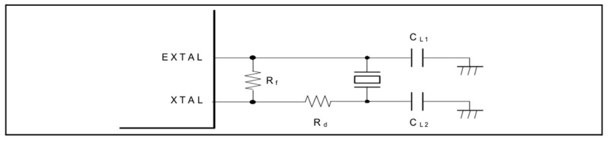

S128 User Manual section 8.3.1 suggests the following connection scheme for all crystals

#### Selecting crystal oscillator load capacitors

Crystals will specify a range/typical expected load capacitance. This load capacitance can be expressed as CL = (CL1\*CL2)/(CL1+CL2) + Cp (parallel combination of CL1 , CL2 and the series combination of those and parasitic capacitance Cp usually in the 2~5 pF range depending on traces) ( page 9). For CL1 = CL2 = C and solving for C = 2\*(CL - Cp) . <http://ww1.microchip.com/downloads/en/appnotes/00826a.pdf>

Capacitors selected should have low temperature coefficients (e.g. C0G).

16 MHz Oscillator

CL = 12 pF and Cp = ~4 pF, so C = 16 pF (each)

[https://media.digikey.com/pdf/Data](https://media.digikey.com/pdf/Data%20Sheets/Jauch%20Quartz%20PDFs/J49SMH_Type_DS.pdf) Sheets/Jauch Quartz PDFs/J49SMH\_Type\_DS.pdf

32.768 kHz Oscillator

CL = 12.5 pF and Cp = ~4 pF, so C = 17 pF (going to use same caps as for the 16 MHz oscillator)

## Serial Wire Debug

Target Interface SWD - SEGGER [Knowledge](https://wiki.segger.com/SWD) Base

- SWCLK: P300 (32)
- SWDIO: P108 (33)

9-pin J-LINK

[J-Link](https://www.segger.com/products/debug-probes/j-link/models/j-link-edu-mini/) EDU Mini

Consumes:

- SWDIO
- SWCLK
- RES connection to S128 MCU
- TDO and TDI are unused

NOTE: the JLINK\_OB/JTAG circuit in the DK-S128 uses U12 (a MCU) and U10B (tri-state buffer) to translate USB to SWD. U12 receives USB communication and bitbangs data through U10B to the SWD pins of the board's MCU. This does not need to be replicated.

## RGB LED

[https://www.digikey.com/en/products/detail/würt](https://www.digikey.com/en/products/detail/w%C3%BCrth-elektronik/155124M173200/7315806) [h-elektronik/155124M173200/7315806](https://www.digikey.com/en/products/detail/w%C3%BCrth-elektronik/155124M173200/7315806)

GPIO drive strength (excluding P000-P004, P010-P015, P212, P213, P500-P502, P408, P409, P914, P915) is +/- 4 mA for low drive, +/- 8 mA for high drive.

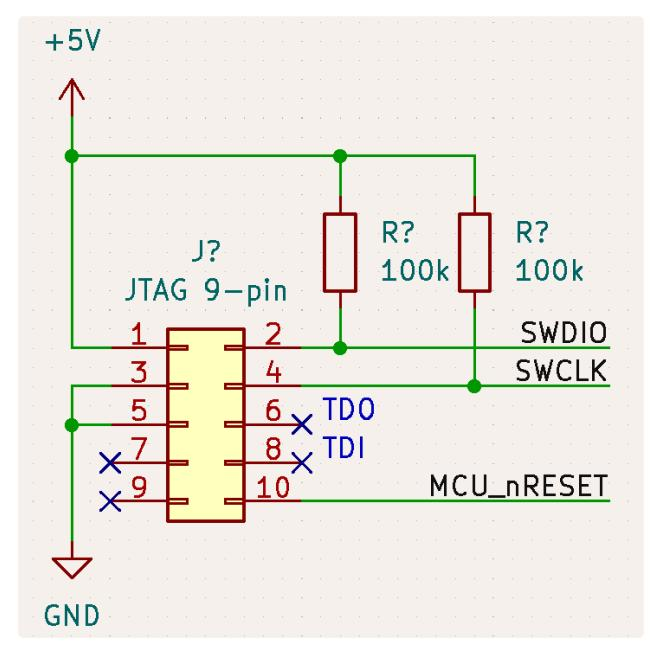

Onboard JTAG connection

Desired thru current: 3 mA or less when powered from 3V3 rail and sunk into MCU GPIO.

| Color | Forward<br>Voltage<br>(V) | Resistor   |
|-------|---------------------------|------------|
| Red   | 2.0                       | 1<br>kOhm  |
| Green | 2.8                       | 750<br>Ohm |
| Blue  | 3.0                       | 666<br>Ohm |

For simplicity's sake, using 1 kOhm for each of these. Can adjust thru current based on user feedback.

## Piezo

[https://www.digikey.com/en/products/detail/mallory-sonalert](https://www.digikey.com/en/products/detail/mallory-sonalert-products-inc/PK-11N40PQ/4996072)[products-inc/PK-11N40PQ/4996072](https://www.digikey.com/en/products/detail/mallory-sonalert-products-inc/PK-11N40PQ/4996072)

The piezo drive current should be delivered by a MOSFET instead of a GPIO. A cheap SOT23-3 FET, capable of handling VGS = 3V was selected. It should be on the low side since the MCU GPIO will only reach 3V.

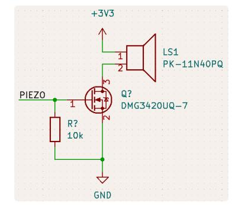

## Power

Remainder of board

Powering with a controllable 3V3 LDO.

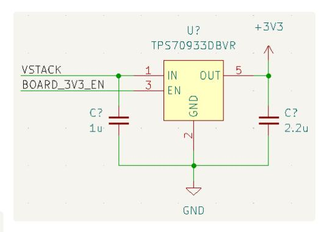

#### MCU Power

To provide a stable power rail for the MCU analog blocks (ADC is this project's concern), a

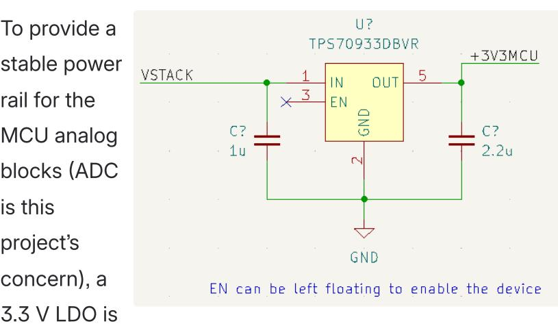

used on board. The chosen LDO, TPS70933DBVR, recommends using a 1u ceramics at IN and a 2.2u ceramic at Vout.

An internal pull-up circuit sets the default of enable to active.

A TLV431 can be populated onboard to provide the ADC with a reference more stable than the MCU's internal reference.

#### Reference voltage

|                                     |                                                                                 |                                                                                                                                                  | TEST CONDITIONS                                               |             |       | TLV431A |       |      |
|-------------------------------------|---------------------------------------------------------------------------------|--------------------------------------------------------------------------------------------------------------------------------------------------|---------------------------------------------------------------|-------------|-------|---------|-------|------|
|                                     | PARAMETER                                                                       |                                                                                                                                                  |                                                               |             |       | TYP     | MAX   | UNIT |
|                                     |                                                                                 |                                                                                                                                                  | T <sub>A</sub> = 25°C                                         |             | 1.228 | 1.24    | 1.252 |      |
|                                     | B ( )                                                                           | V <sub>KA</sub> = V <sub>REF</sub> ,                                                                                                             | (1)                                                           | TLV431AC    | 1.221 |         | 1.259 | v    |
| VREF                                | Reference voltage                                                               | $I_{\rm K} = 10 \text{ mA}$                                                                                                                      | T <sub>A</sub> = full range <sup>(1)</sup><br>(see Figure 22) | TLV431AI    | 1.215 |         | 1.265 | v    |
|                                     |                                                                                 |                                                                                                                                                  | (see rigule zz)                                               | TLV431AQ    | 1.209 |         | 1.271 |      |
|                                     |                                                                                 |                                                                                                                                                  |                                                               | TLV431AC    |       | 4       | 12    | mV   |
| VREF(dev)                           | F(dev) V <sub>REF</sub> deviation over full<br>temperature range <sup>(2)</sup> | V <sub>KA</sub> = V <sub>REF</sub> , I <sub>K</sub> = 10 mA <sup>(1)</sup><br>(see Figure 22) TLV431AI                                           |                                                               | TLV431AI    |       | 6       | 20    |      |
|                                     | temperature range                                                               |                                                                                                                                                  | (see Figure 22) TLV431AQ                                      |             |       | 11      | 31    |      |
| $\Delta V_{REF}$<br>$\Delta V_{KA}$ | Ratio of V <sub>REF</sub> change in cathode<br>voltage change                   | $\label{eq:VKA} \begin{split} V_{KA} &= V_{REF} \text{ to } 6 \ \text{V}, \ \text{I}_{K} = 10 \ \text{mA} \\ (\text{see Figure 23}) \end{split}$ |                                                               |             |       | -1.5    | -2.7  | mV/\ |
| Iret                                | Reference terminal current                                                      | I <sub>K</sub> = 10 mA, R1 = 10 kΩ,<br>R2 = open<br>(see Figure 23)                                                                              |                                                               |             | 0.15  | 0.5     | μΑ    |      |
|                                     |                                                                                 | Lu = 10 mA P1 = 10 k0                                                                                                                            |                                                               | TLV431AC    |       | 0.05    | 0.3   |      |
| ref(dev)                            | I <sub>ref</sub> deviation over full temperature<br>range <sup>(2)</sup>        |                                                                                                                                                  |                                                               | TLV431AI    |       | 0.1     | 0.4   | μΑ   |
|                                     | Tange                                                                           |                                                                                                                                                  | (ace rigure 20)                                               | TLV431AQ    |       | 0.15    | 0.5   |      |
|                                     | Minimum cathode current for                                                     |                                                                                                                                                  | E: 000                                                        | TLV431AC/AI |       | 55      | 80    |      |
| K(min)                              | regulation                                                                      | VKA = VREF (S                                                                                                                                    | KA = V <sub>REF</sub> (see Figure 22) TLV431AQ                |             |       | 55      | 100   | μA   |
| K(ott)                              | Off-state cathode current                                                       | $V_{REF} = 0, V_{KA}$                                                                                                                            | = 6 V (see Figure 24                                          | )           |       | 0.001   | 0.1   | μΑ   |
| z <sub>KA</sub>                     | Dynamic impedance <sup>(3)</sup>                                                | $V_{KA} = V_{REF}$ , f $\leq$ 1 kHz, $I_K = 0.1$ mA to 15 mA<br>(see Figure 22)                                                                  |                                                               |             | 0.25  | 0.4     | Ω     |      |

<https://www.ti.com/lit/ds/symlink/tlv431a.pdf>

$$V_{O} = (1 + R1 / R2) \times V_{ref} - I_{ref} \times R1$$

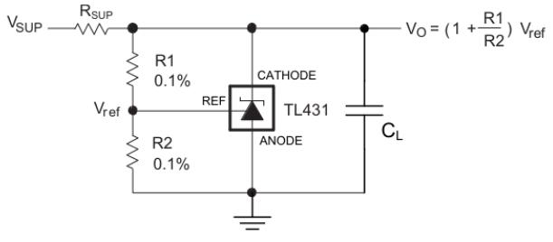

<https://www.ti.com/lit/ds/symlink/tlv431a.pdf>

<https://www.ti.com/lit/ds/symlink/tlv431a.pdf> section 9.2.2.2.1

The recommended cathode current ranges [0.1, 15] mA with an absolute maximum of 20 mA. A 180 ohm R\_{SUP} will pass ~9.2 mA.

In the typical case, V\_{ref} = 1.24 V, I\_{ref} = 0.15 uA. This circuit will not be powered while the SBS is sleeping, so lower resistor values can be used for better noise immunity. Let R1 = 10 kOhm, so R2 = 30 kOhm. With these resistor values, the actual nominal V\_O is ~1.65183 V.

## TLV431 Output [Voltage](https://www.desmos.com/calculator/qap5we216u)

| V_{O}<br>Corner | Conditions                                                                              |
|-----------------|-----------------------------------------------------------------------------------------|
| Low             | Minimum<br>R1,<br>maximum<br>R2,<br>minimum<br>V_{ref},<br>maximum<br>I_{ref}           |
| High            | Maximum<br>R1,<br>minimum<br>R2,<br>maximum<br>V_{ref},<br>minimum<br>I_{ref}<br>(zero) |

| Resistor<br>Values                | Tolerances | V_{O,MIN}<br>(V) | V_{O,MAX}<br>(V) |
|-----------------------------------|------------|------------------|------------------|
| R1<br>10k,<br>R2<br>30k<br>=<br>= | 1%         | 1.6243           | 1.6778           |
| R1<br>10k,<br>R2<br>30k<br>=<br>= | 0.1%       | 1.6315           | 1.6702           |
| R1<br>1k,<br>R2<br>3k<br>=<br>=   | 1%         | 1.6287           | 1.6778           |
| R1<br>1k,<br>R2<br>3k<br>=<br>=   | 0.1%       | 1.6360           | 1.6702           |

The largest contributor to the accuracy of the output voltage is the accuracy of the V\_{ref} signal produced inside the TLV431.

The resistor values and tolerances can be changed independent of the rest of the SBS hardware.

Using a precise external voltage reference reduces the uncertainty of the reference to under +/- 2% from +/- 10%.

ADC Input Clamping

| Input voltage | 5 V tolerant ports*1                         | V <sub>in</sub> | -0.3 to +6.5        | V |
|---------------|----------------------------------------------|-----------------|---------------------|---|
|               | P000 to P004<br>P010 to P015<br>P500 to P502 | V <sub>in</sub> | -0.3 to AVCC0 + 0.3 | V |
|               | Others                                       | V <sub>in</sub> | -0.3 to VCC + 0.3   | V |

S128 Datasheet section 2.1 (Absolute Maximum Ratings)

Consulting the S128 User Manual section 1.7 (Pin Lists) shows the ports related to AVCC0 are ADC inputs AN000 through AN013.

From the of this page, AVCC0 = 3.3 V. An arbitrary upper limit can be set to voltages input to ADC channels of 3 V with a zener diode and a currentlimiting resistor. Analog Power [section](https://aerpaw-uav.atlassian.net/wiki/spaces/VD/pages/182681698/SBS+Design#Analog-Power)

This circuit should be used for every ADC input that can theoretically exceed 3.3 V (e.g. Cell Voltage Difference Amplifiers).

From Smart Battery System | [Modeling](https://aerpaw-uav.atlassian.net/wiki/spaces/VD/pages/164331521/Smart+Battery+System#Modeling-ADC-inputs) ADC inputs , the ADC input resistance is on the order of kOhm and input capacitances on the order of pF. The current-limiting resistor should be adequately sized to limit worst-case current through the zener diode based on the analog voltage's driving capability (but no more than 100 mW dissipated, so 33 mA limit).

# Detect Signal

Detect\_IN is connected to P106 (AN016), which is tolerant up to VCC. Detect\_OUT , driven by a GPIO, can supply up to 4 mA in low drive mode at 3V. Thus, the series resistance can be no less than 750 Ohms.

For the given resistor divider, Rx is the Connected resistor. The high and low side resistors limit the max current and

allows for Rx to be smaller than if only the low-side resistor limited the current.

Rx = RL \* (Vin/Vout - 1) - RH

Rx = 470 \* (3/Vout - 1) - 470

| Mode         | Voltage<br>Min<br>(V) | Voltage<br>Max<br>(V) | Rx<br>Nominal     | Closest<br>E24 |
|--------------|-----------------------|-----------------------|-------------------|----------------|
| No<br>host   | 0                     | 0.1                   | None<br>/<br>open | Open           |
| 12S<br>drone | 0.2                   | 0.3                   | 4.7k              | 4.7k           |
| 6S<br>drone  | 0.4                   | 0.5                   | 2.1933k           | 2.2k           |
| Reserved     | 0.6                   | 1.1                   |                   |                |
| Charger      | 1.2                   | 3                     | Short             | 0              |

# Thermistor

Create a resistor divider with the thermistor as the low leg and a fixed R as the top leg.

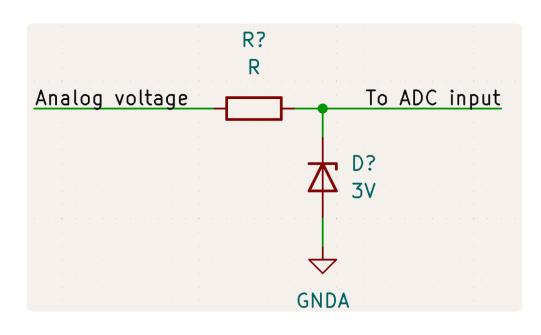

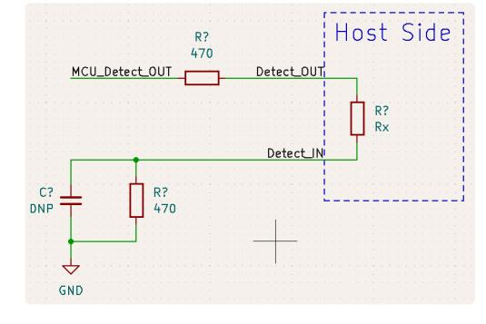

# [NTCLE413E2103H401](https://www.vishay.com/docs/29078/ntcle413.pdf) datasheet

# NTC [Thermistor](https://www.desmos.com/calculator/jdfhc9kqfy)

- Resistor pole powered by 3V3
- Maximum readable voltage is 1.3 V (minimum Vref internal)
- Minimum readable voltage assume is 50 mV
- With RH = 56k and the given thermistor, able to resolve temperatures in range [-1.2, 91] °C
  - Generally, lowering RH shifts the readable range more negative and raising RH shifts it more positive

## Cell, Stack, and Output Voltage measurement

- Max cell voltage expected is 4.3 V → round up to 4.4 V
- Max expected voltage on either pin (for 6S compatibility) is ( 6 cell

```
* 4.4 V/cell = 26.8 V )
```

- V\_{out} = V\_{ref} and V\_{in} = 26.8 V
- Using internal reference, V\_{ref\_internal,min} = 1.30 V
  - Ratio = 1.3/26.8
  - Approximate match: RL = 510, RH = 10k
  - To limit current, use RL = 51k, RH = 1Meg to limit thru current to ~84 uA (for all cells)
    - Since V1 of SBS uses resistor poles for cell measurement, too, the voltage for cell 6 is also the same as the stack voltage, so the pole for the stack can be removed

Using external reference, VREFH0\_{min} = 1.60 V (rounded)

- RL = 750, RH = 24k for a divide ratio of 0.030303030 (inverse is 33.0)
- Scale to RL = 75k and RH = 2.4M to reduce thru current to 52.8 uA

Cell Voltage Difference Amplifiers (deprecated for V1 of SBS)

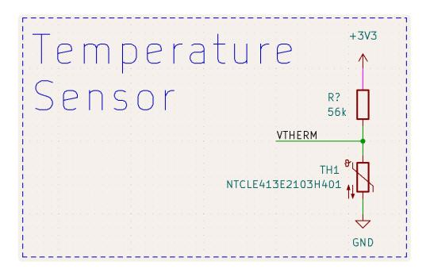

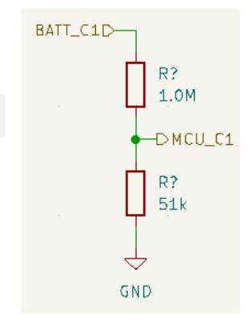

Example cell measurement resistor pole

If this SBS is to be converted to support 12 cell batteries, this entire block must be revised (OPAx990 max supply voltage is 40 V) and current-limiting R based on 6-cell maximum.

A Deeper Look into [Difference](https://www.analog.com/en/analog-dialogue/articles/deeper-look-into-difference-amplifiers.html) Amplifiers | Analog Devices

- Shutdown pins (SHDN) on the OPA4990S use logic levels
  - Open is pulled down internally to logic low, so must input a high to shutdown
  - SHDN pin cannot exceed (V-) + 20V or (V+) (whichever is lower)
- Resistor dividers
  - Max cell voltage expected is 4.3 V → round up to 4.4 V
  - Must scale down by V\_{ref}/4.4 = (R2/R1) (taken from the Op Amp circuit shown)
    - Note that R1 = R3 and R2 = R4
  - Using internal reference, V\_{ref\_internal,min} = 1.30 V
    - R2/R1 = 1.30/4.4 ~=~ 2.7/9.1
  - Using external reference, VREFH0\_{min} = 1.60 V (rounded)
    - R2/R1 = 1.60/4.4 = 1.2/3.3 (both are E24 numbers)
    - \* This is what is used on V1 of the 6S SBS \*
  - Problem: as long as a battery is plugged in, the path from V2 to GND conducts current
    - Keep R on the order of 100k-1M to keep this small
    - Alternative: add a low current FET (~20 mA or higher) between R4 and GND. Enable only when taking ADC measurements. Size R on the order of 1k or 10k to improve noise immunity since this path is closed most of the time.
- Voltage clamp
  - Must limit output to 3 V with zener
  - Highest expected stack voltage is (6 cell \* 4.2 V = 25.2 V)

OPA4990 short-circuit current limit (per amplifier)

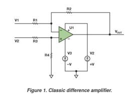

$$V_{OUT} = \left(\frac{R4}{R3 + R4}\right) \times \left(\frac{RI + R2}{RI}\right) \times V2 - \frac{R2}{RI} VI$$
(1)

Four resistor Op Amp circuit Note the - input is above the + input

- Current-limiting resistor shall limit this to 30 mA to not exceed the (arbitrarily chosen) 100 mW zener diode limit → 740 Ohm → 1 kOhm can be used as a current limit
  - This situation likely won't happen since the amplifier would need to be driving 25.2 V for (25.2 - 3) V to appear across the 1k, but this is a worst-case-make-sure-nothing-breaks spec

# FET Array and Gate Driver

- LTC7000 is a high-side N-channel MOSFET gate driver
- This implementation will ignore many features of the LTC7000, somewhat treating it as if it were the LTC7000-1

| Pin      | Summary                                                                                                                                                                                                                                                                                                                                                                                | Connection                                                                                                                                                                                       |
|----------|----------------------------------------------------------------------------------------------------------------------------------------------------------------------------------------------------------------------------------------------------------------------------------------------------------------------------------------------------------------------------------------|--------------------------------------------------------------------------------------------------------------------------------------------------------------------------------------------------|
| RUN      | Active<br>high<br>Chip<br>Enable<br>pin.<br>If<br>logic<br>low,<br>LTC7000<br>enters<br>a<br>shutdown<br>mode.<br>This<br>must<br>be<br>active<br>for<br>INP<br>to<br>have<br>an<br>effect.                                                                                                                                                                                            | Yes                                                                                                                                                                                              |
| V_{IN}   | Chip<br>main<br>supply<br>pin.                                                                                                                                                                                                                                                                                                                                                         | Yes,<br>use<br>a<br>0.1<br>uF<br>ceramic<br>to<br>decouple                                                                                                                                       |
| V_{CC}   | Internal<br>LDO<br>output<br>for<br>gate<br>drivers<br>and<br>internal<br>circuitry.                                                                                                                                                                                                                                                                                                   | Yes,<br>use<br>a<br>1.0<br>uF<br>low<br>ESR<br>ceramic<br>to<br>decouple.<br>Don't<br>use<br>for<br>anything<br>else                                                                             |
| V_{CCUV} | Sets<br>the<br>UVLO<br>for<br>the<br>Gate<br>Drive<br>(V_{CC})<br>pin.<br>Short<br>to<br>GND<br>sets<br>UVLO<br>to<br>3.5<br>V<br>(minimum),<br>open<br>sets<br>UVLO<br>to<br>7.0<br>V.                                                                                                                                                                                                | To<br>minimize<br>opportunity<br>for<br>the<br>gate<br>driver<br>to<br>cut<br>off<br>power,<br>the<br>UVLO<br>should<br>be<br>minimized,<br>so<br>V_{CCUV}<br>will<br>be<br>shorted<br>to<br>GND |
| ~{FAULT} | Open<br>Drain<br>Fault<br>Output<br>-<br>used<br>to<br>notify<br>of<br>an<br>impending<br>FET<br>turnoff<br>as<br>a<br>result<br>of<br>an<br>overcurrent<br>condition.                                                                                                                                                                                                                 | No<br>connect                                                                                                                                                                                    |
| TIMER    | "If<br>the<br>TIMER<br>pin<br>is<br>connected<br>to<br>VCC<br>or<br>any<br>other<br>supply<br>greater<br>than<br>3.5V<br>(abs<br>max<br>15V),<br>an<br>overcurrent<br>event<br>will<br>immediately<br>pull<br>TGDN<br>to<br>TS<br>and<br>the<br>LTC7000/LTC7000-1<br>will<br>remain<br>there<br>until<br>the<br>INP<br>signal<br>has<br>cycled<br>low<br>and<br>then<br>back<br>high." | Connect<br>to<br>VCC<br>since<br>it<br>is<br>not<br>possible<br>for<br>an<br>overcurrent<br>event<br>to<br>arise                                                                                 |

## LTC7000 Pinout

| INP                 | Gate<br>drive<br>enable<br>pin.<br>Fast<br>switching<br>of<br>the<br>gate<br>driver<br>state.<br>RUN<br>must<br>be<br>active<br>for<br>this<br>input<br>to<br>have<br>an<br>effect.           | Yes                                                                                                                                                             |
|---------------------|-----------------------------------------------------------------------------------------------------------------------------------------------------------------------------------------------|-----------------------------------------------------------------------------------------------------------------------------------------------------------------|
| OVLO                | Overvoltage<br>lockout<br>input.                                                                                                                                                              | No<br>-<br>"tied<br>to<br>GND<br>when<br>not<br>used"                                                                                                           |
| I_{SET}             | Sets<br>the<br>overcurrent<br>threshold<br>measured<br>by<br>the<br>shunt<br>resistor<br>(across<br>SNS+<br>to<br>SNS-<br>pins).<br>Leave<br>open<br>for<br>a<br>threshold<br>of<br>30<br>mV. | SNS+<br>and<br>SNS-<br>will<br>have<br>0V<br>difference,<br>so<br>this<br>can<br>be<br>left<br>open<br>to<br>set<br>a<br>threshold<br>of<br>30<br>mV            |
| I_{MON}             | SNS+<br>SNS-<br>Voltage<br>output<br>=<br>20<br>(<br>-<br>).<br>*                                                                                                                             | No<br>connect                                                                                                                                                   |
| TGDN                | Gate<br>drive<br>pulldown.                                                                                                                                                                    | Connect<br>directly<br>to<br>FET<br>gate<br>for<br>fastest<br>turn-off                                                                                          |
| TGUP                | Gate<br>drive<br>pullup.                                                                                                                                                                      | Connect<br>directly<br>to<br>FET<br>gate<br>for<br>fastest<br>turn-on;<br>connect<br>through<br>resistor<br>to<br>control<br>inrush<br>current                  |
| TS                  | FET<br>source<br>connection.                                                                                                                                                                  | Connect<br>directly<br>to<br>FET<br>sources                                                                                                                     |
| BST                 | High-side<br>bootstrap<br>supply.<br>Voltage<br>swing<br>on<br>this<br>pin<br>is<br>12V<br>to<br>V_{IN}<br>+<br>12V.                                                                          | Connect<br>to<br>TS<br>through<br>a<br>minimum<br>0.1<br>uF<br>cap                                                                                              |
| SNS-<br>and<br>SNS+ | Current<br>sense<br>comparator<br>input.<br>Desired<br>input<br>voltage<br>range<br>is<br>3.5<br>to<br>150<br>V.                                                                              | Do<br>not<br>connect<br>across<br>a<br>shunt<br>resistor<br>Instead,<br>connect<br>both<br>terminals<br>to<br>the<br>drain<br>of<br>the<br>battery-side<br>FETs |
| GND<br>(EPAD)       | Ground<br>pad.                                                                                                                                                                                | Solder<br>directly<br>to<br>PCB<br>for<br>rated<br>electrical<br>and<br>thermal<br>performance                                                                  |

## Limit Inrush Current

The turn-on time is controlled by C\_G and R\_G (both are external components we get to choose). The load capacitance is something we estimate. The 10 Ohm resistor can be low power - it's meant to dampen oscillations.

## Don't need to limit

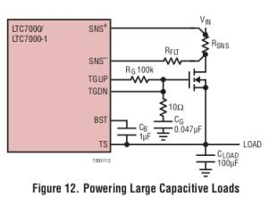

#### Reverse Current Protection (aka "load switching")

Just as a reference, this is how the shunt terminals should be connected in case of back-to-back FETs

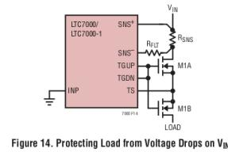

#### Flyback diode connection to TS

The Schottky (for fast turn-on) should be rated for at least 25.2 V (6 cell \* 4.2 V) → around 50 V or higher for a safety factor.

This diode should not be tiny since it will need to handle (0.7 V)(~10 A) for a short time in the worst case. Since the gate driver won't cut off while drone is mid-flight, it would be on the ground. The ideal diode max tolerable current is 10 A, so assume all the current is flowing through the FET array.

Choose a schottky in a DPAK/TO-252-3 package so they can be easily swapped.

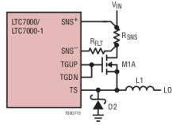

## Current Amplifiers

Shunt resistance R\_{shunt} = 300 uOhm

| Feature  | Notes                                                                                            |
|----------|--------------------------------------------------------------------------------------------------|
| Accuracy | V_{os}<br>=<br>R_{shunt}<br>*<br>Op<br>Amp<br>Offset<br>Voltage:<br>I_{inaccuracy}               |
|          | R_{shunt}<br>=<br>300<br>uOhm<br>I_{inaccuracy}<br>=<br>V_{os}<br>/<br>For<br>,<br>(300<br>uOhm) |

|                 |               | V_{os}<br>=<br>+-                    | 12<br>uV<br>→                                     | I_{inaccuracy}              | =<br>(12            | uV)<br>/      |       |
|-----------------|---------------|--------------------------------------|---------------------------------------------------|-----------------------------|---------------------|---------------|-------|
|                 | (300          | uOhm)                                | =<br>40<br>mA                                     |                             |                     |               |       |
| Common-mode     |               | Common-mode                          | input<br>range<br>=                               | [-0.2,<br>40]<br>V          | high-side<br>→      | config<br>for |       |
|                 |               | V_{stack}                            | <<br>40<br>V                                      |                             |                     |               |       |
| Differential    |               | Differential<br>may                  | be<br>within<br>+/-<br>42<br>V                    | can<br>read<br>the<br>→     | forward/reverse     | current       |       |
| maximum         |               |                                      |                                                   |                             |                     |               |       |
|                 |               |                                      |                                                   |                             |                     |               |       |
|                 |               |                                      |                                                   |                             |                     |               |       |
|                 |               |                                      |                                                   |                             |                     |               |       |
|                 |               |                                      |                                                   |                             |                     |               |       |
|                 |               |                                      |                                                   |                             |                     |               |       |
|                 |               |                                      |                                                   |                             |                     |               |       |
|                 |               |                                      |                                                   |                             |                     |               |       |
|                 |               |                                      |                                                   |                             |                     |               |       |
|                 | Lowest        | gain<br>(25)                         | saturates<br>(above                               | ADC<br>Vref<br>=<br>1.45V)  | at<br>~192<br>A.    |               |       |
|                 |               |                                      |                                                   |                             |                     |               |       |
|                 |               |                                      |                                                   |                             |                     |               |       |
|                 |               |                                      |                                                   |                             |                     |               |       |
|                 |               |                                      |                                                   |                             |                     |               |       |
|                 |               |                                      |                                                   |                             |                     |               |       |
|                 |               |                                      |                                                   |                             |                     |               |       |
|                 |               |                                      |                                                   |                             |                     |               |       |
|                 |               |                                      |                                                   |                             |                     |               |       |
|                 |               |                                      |                                                   |                             |                     |               |       |
|                 |               |                                      |                                                   |                             |                     |               |       |
|                 |               |                                      |                                                   |                             |                     |               |       |
| Output<br>swing | The<br>0<br>V | output<br>voltage<br>when<br>reading | can<br>only<br>swing<br>current<br>of<br>opposite | between<br>GND<br>polarity) | and<br>VS<br>(won't | output        | below |

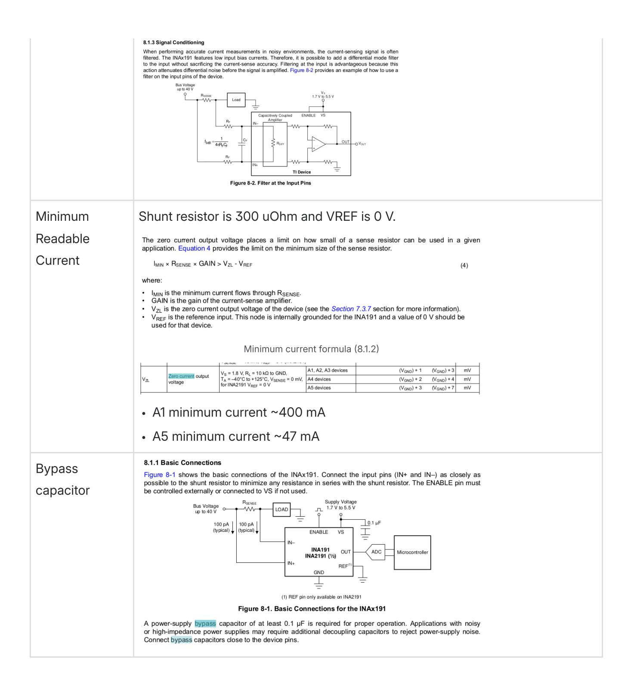

# Ideal Diode

- Must enable load switching and inrush control
- \* Using same FETs for ideal diode as for FET array on V1 of 6S SBS \*

Feature Par ts Notes

| Bare<br>Minimum                                  | Q1                                   |                                                                                                                                                                                                                                                                                                                                                                                                                                                                                                                                                                                                                                                                                                                                                                                                          |
|--------------------------------------------------|--------------------------------------|----------------------------------------------------------------------------------------------------------------------------------------------------------------------------------------------------------------------------------------------------------------------------------------------------------------------------------------------------------------------------------------------------------------------------------------------------------------------------------------------------------------------------------------------------------------------------------------------------------------------------------------------------------------------------------------------------------------------------------------------------------------------------------------------------------|
| Load<br>Switching                                | Q2,<br>R3                            | R3<br>prevents<br>Q2<br>parasitic<br>oscillations                                                                                                                                                                                                                                                                                                                                                                                                                                                                                                                                                                                                                                                                                                                                                        |
| Inrush<br>control<br>(aka<br>"soft<br>starting") | C1,<br>R4                            | For<br>R4<br>being<br>10kOhm,<br>the<br>inrush<br>current<br>is<br>described<br>by<br>the<br>equation<br>below,<br>where<br>C_{LOAD}<br>is<br>the<br>estimated<br>worst<br>case<br>load<br>capacitance<br>that<br>this<br>circuit<br>is<br>expected<br>to<br>drive.<br>The<br>ideal<br>diode<br>inrush<br>current<br>should<br>be<br>limited<br>to<br>10<br>A<br>and<br>the<br>load<br>capacitance<br>worst-case<br>is<br>approximately<br>6000<br>uF.<br>This<br>sets<br>C1<br>to<br>6<br>nF<br>exactly,<br>but<br>the<br>closest<br>cap<br>value<br>greater<br>than<br>this<br>is<br>6.8<br>nF,<br>which<br>sets<br>the<br>inrush<br>to<br>8.82<br>A.<br>A<br>smaller<br>value<br>is<br>not<br>used<br>to<br>avoid<br>exceeding<br>the<br>10<br>A<br>inrush<br>current<br>requirement.<br>REVIEW<br>ME |
| Reverse<br>recovery<br>voltage<br>spikes         | D1,<br>R1,<br>D2,<br>CO<br>UT,<br>D4 | From<br>commutation<br>(switching),<br>reverse<br>recovery<br>spikes<br>can<br>be<br>seen<br>on<br>OUT,<br>IN,<br>and<br>SOURCE.<br>Unlike<br>the<br>datasheet,<br>the<br>"input<br>short<br>circuit"<br>condition<br>is<br>can't<br>occur<br>because<br>the<br>battery<br>is<br>not<br>disconnected<br>when<br>supplying<br>power<br>nor<br>would<br>a<br>short<br>appear<br>across<br>the<br>battery<br>input<br>terminals.                                                                                                                                                                                                                                                                                                                                                                            |

The ideal diode will also be supplying a current on the order of 0.5 A to several amps. The gate ramp set up by C1 and R4 will prevent large inrush currents.

The greatest load step cases are when first enabling the ideal diode and disconnecting the load. Because the supply current is small, inductive kickbacks will be as well.

D1 protects IN and SOURCE during load steps and overvoltage conditions. The only power source to be used by the 6S SBS is a 6-cell battery (4.2 V/cell), so overvoltage protection is not needed. The small supply current and inrush control will mitigate the load step voltage spikes, so this feature isn't required either.

D2 blocks conduction for a range reverse input voltages caused by reverse recovery. Because of the small current supply, these spikes are being ignored.

"If reverse input protection and fast turn off time are not required, R1 can be removed and VSS connected to system ground." COUT is also meant to preserve fast turn-off times and absorbing reverse recovery energy. Both of these components are being omitted.

D4 prevents VGS from increasing in case of a negative spike on IN or SOURCE. These spikes are being ignored because they are expected to be small.

If this SBS is to be converted to support 12 cell batteries, including components described in this section is strongly encouraged.