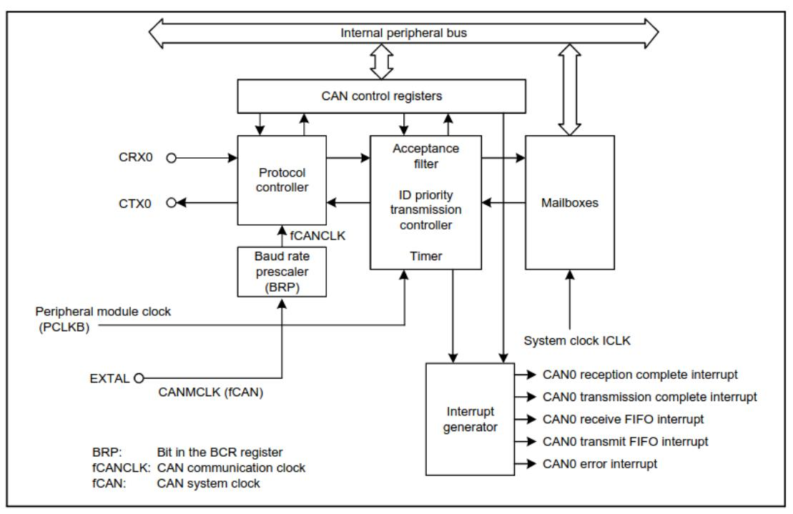
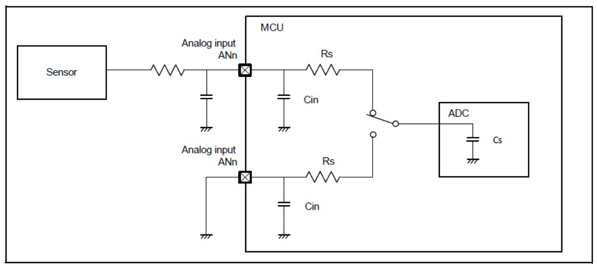

Smart Battery System
====================

.. toctree::
   :maxdepth: 1

   VD_SBS

https://github.com/AERPAW/sbs

TODO List
~~~~~~~~~

-  

   1. Convert text description of behavioral flowchart to a
      diagram/picture

-  

   2. Determine what resistors to use for voltage diff amps

-  

   3. Determine if ideal diode FETs are same as those in the
      high-current FET array

-  

   4. Map MCU pins to board functions

-  

   5. Determine if MCU GPIOs go high impedance when MCU goes to sleep

   -  a.If yes, configure pull-up/down resistors on control signals for
      sleep state

-  

   6. Look for cell voltage measurement amps for 12S levels

   -  

      a. See if anything else is incompatible

      -  

         i. Will need to move shunt to low-side measurement

   -  

      b. Don’t limit to parts with a shutdown pin

-  

   7. Determine resistor divide ratios for VOUT_DIVIDED and
      VSTACK_DIVIDED

   -  

      a. Add zener clamps to these as well

-  

   8. Determine if cell voltage diff amps should use Vref=1.3V resistor
      ratios or if Vref=1.6 is ok

-  

   9. Add pull-ups to I2C if needed

-  

   10. Measure the average power consumption of the SBS write that into
       the MCU ROM

Requirements
============

-  `Interface <https://aerpaw-uav.atlassian.net/l/cp/KRZx15VE>`__

   -  Battery CANBUS & Balance connector

      -  CANBUS and I2C connections

         -  Must be opto-isolated because, when stacking multiple 6S
            SBS, each module’s “ground” is not 0 V to the Cube, but a
            sum of all the battery stack voltages below it
         -  CAN must be capable of 5 Mbps (future systems may use
            high-speed CAN FD) (
            `CA <https://www.can-cia.org/index.php?id=systemdesign-can-physicallayer#high>`__
            N in
            `Automation <https://www.can-cia.org/index.php?id=systemdesign-can-physicallayer#high>`__
            (CiA) )

      -  Cell voltages (C_n) feed directly to the battery charger

         -  These shall function if no component is populated on the SBS
            PCB
         -  The 6S SBS uses only C_1 through C_6, so C_7 through C_12
            are “no connects”

-  Detect_OUT and Detect_IN will be connected by the Host
-  The Host is responsible for connecting the cells, CAN, I2C, 5V, GND,
   and Detect pins properly
-  Battery High Current

   -  The load capacitance may be estimated to be a maximum of 6000 uF

-  Shall contain a separate header on the PCB for UART debugging
-  Shall measure each cell voltage and the entire stack voltage
-  Shall measure the battery current in the range [-190, 190] A

   -  Needs higher precision at smaller currents [-1, 1] A because it
      can spend a long time supplying a small currents

-  Shall measure the voltage on the output terminals

   -  Determines whether connected to charger

-  Shall provide an ideal diode setup for low current (drone on ground)
   setups to allow for hotswapping battery stacks

   -  The ideal diode setup shall enable inrush control and load
      switching
   -  Shall be able to enforce a maximum current through the ideal diode
      10 A (the limit is configurable by the firmware - use the current
      amplifiers and compare to a constant)
   -  Shall limit the inrush current to 10 A (same as max current listed
      above)

-  Shall allow for regenerative braking (reverse current to charge
   batteries) while drone in flight
-  Shall contain a NTC thermistor for temperature measurement/reporting
   by software
-  Shall contain a piezo

   -  Low battery warning

-  Shall contain a RGB LED for SoC indication

   -  If easy enough, have several DNP LEDs in a row for indicating SoC
      (more intuitive)

-  Shall read a resistance across Detect_OUT ↔︎ Detect_IN to indicate
   operation modes

   -  Resistance 0 (short) means connected to charger
   -  Resistance 4.7k means connected to 12S drone
   -  Resistance 2.2k means connected to 6S drone
   -  Open means nothing is connected

Software Notes
==============

-  e^2 studio: e²
   `studio <https://www.renesas.com/us/en/software-tool/e-studio>`__

   -  Install Synergy Software Package Renesas
      `Synergy™ <https://www.renesas.com/us/en/products/microcontrollers-microprocessors/renesas-synergy-platform-mcus/renesas-synergy-software-package>`__
      Software Package (SSP)

-  DK-S128 S128
   `Development <https://www.renesas.com/us/en/products/microcontrollers-microprocessors/renesas-synergy-platform-mcus/rtk7dks128s00001bu-dk-s128-development-kit>`__
   Kit
-  `High-level <https://www.renesas.com/us/en/document/qsg/development-kit-s128-dk-s128-quick-start-guide?r=1261681>`__
   overview
-  Detailed
   `description <https://www.renesas.com/us/en/document/mat/development-board-kit-s128-dk-s128-users-manual-v20?r=1261681>`__
-  Board
   `design <https://www.renesas.com/us/en/document/pcs/renesas-synergy-development-kit-dk-s128-v20-design-data?r=1261681>`__
   data (we have rev. 2)

MCU Notes
=========

Pin Mappings
------------

-  Can probably simplify the shutdown/enable signals, but leaving this
   open as a placeholder
-  Place Detect_OUT driver and Detect_IN resistor divider reading close
   together

+---+---+-----------------+----------------------------------------------+
| P | S | Port            | Notes                                        |
| i | i |                 |                                              |
| n | g |                 |                                              |
| T | n |                 |                                              |
| y | a |                 |                                              |
| p | l |                 |                                              |
| e |   |                 |                                              |
+===+===+=================+==============================================+
| A | A | P000P           | “PinsAN000toAN013cannotbe                    |
| D | N | 004,P010P015,P5 | usedasgeneralI/O,IRQ2input,orforTStransmissi |
| C | 0 | 00P502,P100P106 | onwhentheA/Dconverterisinuse.”(S128Datasheet |
|   | 0 |                 | Table2.48)Therefore,pinswiththefunctionsAN00 |
|   | 0 |                 | 0AN013shallbeselectedforADCinputsAN016AN022. |
|   | A |                 |                                              |
|   | N |                 |                                              |
|   | 0 |                 |                                              |
|   | 1 |                 |                                              |
|   | 3 |                 |                                              |
|   | A |                 |                                              |
|   | N |                 |                                              |
|   | 0 |                 |                                              |
|   | 1 |                 |                                              |
|   | 6 |                 |                                              |
|   | A |                 |                                              |
|   | N |                 |                                              |
|   | 0 |                 |                                              |
|   | 2 |                 |                                              |
|   | 2 |                 |                                              |
+---+---+-----------------+----------------------------------------------+
| G | n | P000            |                                              |
| P | / | P004,P010P015,P |                                              |
| I | a | 100P113,P201,P2 |                                              |
| O |   | 04P206,P212P213 |                                              |
|   |   | ,P300P304,P400P |                                              |
|   |   | 403,P407P411,P5 |                                              |
|   |   | 00P502,P914P915 |                                              |
+---+---+-----------------+----------------------------------------------+
| G |   | P200,P214P215   |                                              |
| P |   |                 |                                              |
| I |   |                 |                                              |
+---+---+-----------------+----------------------------------------------+
| I | I |                 |                                              |
| R | R |                 |                                              |
| Q | Q |                 |                                              |
|   | 0 |                 |                                              |
|   | I |                 |                                              |
|   | R |                 |                                              |
|   | Q |                 |                                              |
|   | 7 |                 |                                              |
+---+---+-----------------+----------------------------------------------+

+---+-----------+---+-----------------------------------------------------+
| T | Function  | Q | Pin(s)MCU                                           |
| y |           | u |                                                     |
| p |           | a |                                                     |
| e |           | n |                                                     |
|   |           | t |                                                     |
|   |           | i |                                                     |
|   |           | t |                                                     |
|   |           | y |                                                     |
+===+===========+===+=====================================================+
| A | Shu       | 4 | I_FORWARD_HIGHRANGE:                                |
| D | ntamplifi |   | AN003(P003)I_FORWARD_LOWRANGE:AN002(P002)I_REVERSE_ |
| C | erreading |   | HIGHRANGE:AN001(P001)I_REVERSE_LOWRANGE:AN000(P000) |
+---+-----------+---+-----------------------------------------------------+
| A | Cellvolta | 6 | MCU_VCELL6:AN012(P501)MCU_VCEL                      |
| D | gereading |   | L5:AN011(P502)MCU_VCELL4:AN010(P015)MCU_VCELL3:AN00 |
| C |           |   | 9(P014)MCU_VCELL2:AN008(P013)MCU_VCELL1:AN007(P012) |
+---+-----------+---+-----------------------------------------------------+
| A | Thermist  | 1 | VTHERM:AN017(P105)                                  |
| D | orreading |   |                                                     |
| C |           |   |                                                     |
+---+-----------+---+-----------------------------------------------------+
| A | Dete      | 1 | Detect_IN:AN016(P106)                               |
| D | ct_INresi |   |                                                     |
| C | stordivid |   |                                                     |
|   | erreading |   |                                                     |
+---+-----------+---+-----------------------------------------------------+
| A | V         | 1 | VOUT_DIVIDED:AN004(P004)                            |
| D | OUT_DIVID |   |                                                     |
| C | EDreading |   |                                                     |
+---+-----------+---+-----------------------------------------------------+
| A | VST       | 1 | VSTACK_DIVIDED:AN013(P500)                          |
| D | ACK_DIVID |   |                                                     |
| C | EDreading |   |                                                     |
+---+-----------+---+-----------------------------------------------------+
| S | CAN0      | 1 | SBS                                                 |
| e |           |   | _CAN_RX:CRX0_C(P102)(46)SBS_CAN_TX:CTX0_C(P103)(45) |
| r |           |   |                                                     |
| i |           |   |                                                     |
| a |           |   |                                                     |
| l |           |   |                                                     |
+---+-----------+---+-----------------------------------------------------+
| S | I2C1      | 1 | SBS_I                                               |
| e |           |   | 2C_SDA:SDA1_B(P101)(47)SBS_I2C_SCL:SCL1_B(P100)(48) |
| r |           |   |                                                     |
| i |           |   |                                                     |
| a |           |   |                                                     |
| l |           |   |                                                     |
+---+-----------+---+-----------------------------------------------------+
| S | UART      | 1 | SBS_U                                               |
| e |           |   | ART_RX:RXD9_B(P110)(35)SBS_UART_TX:TXD9_B(P109)(34) |
| r |           |   |                                                     |
| i |           |   |                                                     |
| a |           |   |                                                     |
| l |           |   |                                                     |
+---+-----------+---+-----------------------------------------------------+
| S | JTAG(     | 1 | SWCLK:SWCLK(P300)(32)SWDIO:SWDIO(P108)(33)          |
| e | programmi |   |                                                     |
| r | ng/debug) |   |                                                     |
| i |           |   |                                                     |
| a |           |   |                                                     |
| l |           |   |                                                     |
+---+-----------+---+-----------------------------------------------------+
| G | RGBLED    | 3 | RGB_BL                                              |
| P |           |   | UE:(P302)(30)RGB_RED:(P303)(29)RGB_GREEN:(P304)(28) |
| I |           |   |                                                     |
| O |           |   |                                                     |
+---+-----------+---+-----------------------------------------------------+

+---+--------------------------+------------+--------------------------+
| G | Piezo                    | 1          | PIEZO:(P206)(22)         |
| P |                          |            |                          |
| I |                          |            |                          |
| O |                          |            |                          |
+===+==========================+============+==========================+
| G | SHDN_C                   | 1          | SHDN_                    |
| P | ELL_VMEASURE(activehigh) |            | CELL_VMEASURE:(P104)(44) |
| I |                          |            |                          |
| O |                          |            |                          |
+---+--------------------------+------------+--------------------------+
| G | EN_C                     | 1          | EN                       |
| P | URRENT_SENSE(activehigh) |            | _CURRENT_SENSE:(P401)(2) |
| I |                          |            |                          |
| O |                          |            |                          |
+---+--------------------------+------------+--------------------------+
| G | EN                       | 1          | E                        |
| P | _IDEAL_DIODE(activehigh) |            | N_IDEAL_DIODE:(P113)(38) |
| I |                          |            |                          |
| O |                          |            |                          |
+---+--------------------------+------------+--------------------------+
| G | EN_FET_ARRAY(activehigh) | 1          | EN_FET_ARRAY:(P111)(36)  |
| P |                          |            |                          |
| I |                          |            |                          |
| O |                          |            |                          |
+---+--------------------------+------------+--------------------------+
| G | ~{SHDN_FET_              | 1          | ~{SHDN_FET_              |
| P | ARRAY_DRIVER}(activelow) |            | ARRAY_DRIVER}:(P112)(36) |
| I |                          |            |                          |
| O |                          |            |                          |
+---+--------------------------+------------+--------------------------+
| G | D                        | min4,max8  | nomapping                |
| P | ebug/state-of-chargeLEDs |            |                          |
| I |                          |            |                          |
| O |                          |            |                          |
+---+--------------------------+------------+--------------------------+
| G | Detect_OUTdriver         | 1          | Detect_OUT:(P107)(41)    |
| P |                          |            |                          |
| I |                          |            |                          |
| O |                          |            |                          |
+---+--------------------------+------------+--------------------------+

CAN Communication
~~~~~~~~~~~~~~~~~

8. Hardware design
   `recommendations <https://legacy.uavcan.org/Specification/8._Hardware_design_recommendations/>`__
   - UAVCAN

|image1|

Analog Voltages / ADC
---------------------

Maximum pin voltages

+--------------+-------------------------+---------+--------------+---+
| Parameter    |                         | Symbol  | Value        | U |
|              |                         |         |              | n |
|              |                         |         |              | i |
|              |                         |         |              | t |
+==============+=========================+=========+==============+===+
| Power supply |                         | VCC     | -0.5 to +6.5 | V |
| voltage      |                         |         |              |   |
+--------------+-------------------------+---------+--------------+---+
| Input        | 5 V tolerant ports*1    | V in    | -0.3 to +6.5 | V |
| voltage      |                         |         |              |   |
+--------------+-------------------------+---------+--------------+---+
|              | P000 to P004P010 to     | V in    | -0.3 to      | V |
|              | P015P500 to P502        |         | AVCC0 + 0.3  |   |
+--------------+-------------------------+---------+--------------+---+
|              | Others                  | V in    | -0.3 to VCC  | V |
|              |                         |         | + 0.3        |   |
+--------------+-------------------------+---------+--------------+---+
| Reference    | voltage                 | VREFH0  | -0.3 to +6.5 | V |
| power supply |                         |         |              |   |
| v            |                         |         |              |   |
+--------------+-------------------------+---------+--------------+---+
| Analog power | age                     | AVCC0   | -0.5 to +6.5 | V |
| supply volta |                         |         |              |   |
+--------------+-------------------------+---------+--------------+---+
| USB power    | 9                       | VCC_USB | -0.5 to +6.5 | V |
| supply       |                         |         |              |   |
| voltage      |                         |         |              |   |
+--------------+-------------------------+---------+--------------+---+
|              |                         | VCC_    | -0.5 to +6.5 | V |
|              |                         | USB_LDO |              |   |
+--------------+-------------------------+---------+--------------+---+
| Analog input | When AN000 to AN013 are | V AN    | -0.3 to      | V |
| voltage      | used                    |         | AVCC0 + 0.3  |   |
+--------------+-------------------------+---------+--------------+---+
|              | When AN016 to AN022 are |         | -0.3 to VCC  | V |
|              | used                    |         | + 0.3        |   |
+--------------+-------------------------+---------+--------------+---+
| Operating    | 3                       | T opr   | -40 to       | ° |
| t            |                         |         | +85-40 to    | C |
| emperature*2 |                         |         | +105         |   |
+--------------+-------------------------+---------+--------------+---+
| Storage      |                         | T stg   | -55 to +125  | ° |
| temperature  |                         |         |              | C |
+--------------+-------------------------+---------+--------------+---+

-  Consulting the S128 User Manual section 1.7 (Pin Lists) shows the
   ports related to AVCC0 are ADC inputs AN000 through AN013
-  AN016..AN022 are tolerant of voltages up to VCC
-  Reference voltages

   -  Internal reference

+-----------------------------------------+---+---+---+---+-----------+
| Parameter                               | M | Т | M | U | Test      |
|                                         | i | у | a | n | c         |
|                                         | n | р | x | i | onditions |
|                                         |   |   |   | t |           |
+=========================================+===+===+===+===+===========+
| Internal reference voltage              | 1 | 1 | 1 | V | -         |
| inputchannel\* 2                        | . | . | . |   |           |
|                                         | 3 | 4 | 5 |   |           |
|                                         | 6 | 3 | 0 |   |           |
+-----------------------------------------+---+---+---+---+-----------+
| Frequency*3                             | 1 | - | 2 | M | -         |
|                                         |   |   |   | H |           |
|                                         |   |   |   | z |           |
+-----------------------------------------+---+---+---+---+-----------+
| Sampling time*4                         | 5 | - | - | μ | -         |
|                                         | . |   |   | s |           |
|                                         | 0 |   |   |   |           |
+-----------------------------------------+---+---+---+---+-----------+

S128 User Manual Table 46.49
^^^^^^^^^^^^^^^^^^^^^^^^^^^^

Internal reference experiment

Variation in internal reference may be more subject to temperature and
AVCC0 than random noise

+---------+-----------+----------+------------+------+----+-------+---+
| E       | r         | arean    | option(    | A    | a  | V     | ) |
| xternal | eferences |          |            | VCC0 | nd | REFH0 |   |
+=========+===========+==========+============+======+====+=======+===+
|         |           |          |            |      |    |       |   |
+---------+-----------+----------+------------+------+----+-------+---+

+--------------------------+-----------+--------------+---+---+-----+---+
| Analog power supply      | AV        |              | 1 | - | 5.5 | V |
| voltages                 | CC0\ *1,* |              | . |   |     |   |
|                          | 2         |              | 6 |   |     |   |
+==========================+===========+==============+===+===+=====+===+
|                          | AVSS0     |              | - | 0 | -   | V |
+--------------------------+-----------+--------------+---+---+-----+---+
|                          | VREFH0    | When used as | 1 | - | AV  | V |
|                          |           |              | . |   | CC0 |   |
|                          |           |              | 6 |   |     |   |
+--------------------------+-----------+--------------+---+---+-----+---+
|                          | VREFL0    | ADC14        | - | 0 | -   | V |
|                          |           | Reference    |   |   |     |   |
+--------------------------+-----------+--------------+---+---+-----+---+

S128 Datasheet Table 2.2 (Recommended operating conditions : min, typ,
max, unit)

-  AVCC0 is the analog block supply rail

   -  Refer to the SBS
      `Design <https://aerpaw-uav.atlassian.net/l/cp/8C2nr3wA>`__
      “Analog Power” section for the value

-  VREFH0 is an optional high-side external reference can be supplied in
   case the internal reference isn’t accurate enough

   -  This voltage cannot go below 1.6 V, so supplying a ‘more stable
      1.45 V’ is unfortunately not an option

Modeling ADC inputs

|image2|

Figure 2.62 from MCU
`Datasheet <https://www.renesas.com/us/en/document/dst/s128-microcontroller-group-datasheet>`__

+-------------------+---+---+---+---------------+---+------------------+
| Parameter         |   | M | Т | Max           | U | Test Conditions  |
|                   |   | i | у |               | n |                  |
|                   |   | n | р |               | i |                  |
|                   |   |   |   |               | t |                  |
+===================+===+===+===+===============+===+==================+
| Frequency         |   | 1 | - | 64            | M | -                |
|                   |   |   |   |               | H |                  |
|                   |   |   |   |               | z |                  |
+-------------------+---+---+---+---------------+---+------------------+
| Analog input      | C | - | - | 8 (reference  | p | High-precision   |
| capacitance*2     | s |   |   | data)         | F | channel          |
+-------------------+---+---+---+---------------+---+------------------+
|                   |   | - | - | 9 (reference  | p | Normal-precision |
|                   |   |   |   | data)         | F | channel          |
+-------------------+---+---+---+---------------+---+------------------+
| Analog input      | R | - | - | 2.5           | k | High-precision   |
| resistance        | s |   |   | (reference    | Ω | channel          |
|                   |   |   |   | data)         |   |                  |
+-------------------+---+---+---+---------------+---+------------------+
|                   |   | - | - | 6.7           | k | Normal-precision |
|                   |   |   |   | (reference    | Ω | channel          |
|                   |   |   |   | data)         |   |                  |
+-------------------+---+---+---+---------------+---+------------------+
| Analog input      | A | 0 | - | VREFH0        | ۷ | -                |
| voltage range     | i |   |   |               |   |                  |
|                   | n |   |   |               |   |                  |
+-------------------+---+---+---+---------------+---+------------------+

Table 2.41 from MCU
`Datasheet <https://www.renesas.com/us/en/document/dst/s128-microcontroller-group-datasheet>`__

+---------------+---------------------+-----+---+---+---+---+-----------------+
| Parameter     |                     | Sym | M | Т | M | U | Test conditions |
|               |                     | bol | i | у | a | n |                 |
|               |                     |     | n | р | x | i |                 |
|               |                     |     |   |   |   | t |                 |
+===============+=====================+=====+===+===+===+===+=================+
| Input leakage | RES, Ports P200,    | I   | - | - | 1 | μ | V in = 0 VV in  |
| current       | P214, P215          | in  |   |   | . | Α | = VCC           |
|               |                     |     |   |   | 0 |   |                 |
+---------------+---------------------+-----+---+---+---+---+-----------------+
| Three-state   | 5V-tolerant ports   | I   | - | - | 1 | μ | V in = 0 VV in  |
| l             |                     | TSI |   |   | . | Α | = 5.8 V         |
| eakagecurrent |                     |     |   |   | 0 |   |                 |
| (off state)   |                     |     |   |   |   |   |                 |
+---------------+---------------------+-----+---+---+---+---+-----------------+
|               | Other ports         |     | - | - | 1 |   | V in = 0 VV in  |
|               |                     |     |   |   | . |   | = VCC           |
|               |                     |     |   |   | 0 |   |                 |
+---------------+---------------------+-----+---+---+---+---+-----------------+
| Input pull-up | All ports(except    | R U | 1 | 2 | 5 | k | V in = 0 V      |
| resistor      | for P200, P214,     |     | 0 | 0 | 0 | Ω |                 |
|               | P215,P914, P915)    |     |   |   |   |   |                 |
+---------------+---------------------+-----+---+---+---+---+-----------------+
| Input         | USB_DP, USB_DM,     | C   | - | - | 3 | p | V in = 0 V      |
| capacitance   | P200                | in  |   |   | 0 | F |                 |
+---------------+---------------------+-----+---+---+---+---+-----------------+
|               | Other input pins    |     | - | - | 1 |   | f = 1 MHzT a =  |
|               |                     |     |   |   | 5 |   | 25°C            |
+---------------+---------------------+-----+---+---+---+---+-----------------+

Table 2.10 from MCU
`Datasheet <https://www.renesas.com/us/en/document/dst/s128-microcontroller-group-datasheet>`__

Low Power Modes
^^^^^^^^^^^^^^^

There are two dimensions to low power functions:

-  

   1. Low power mode (Sleep, Software Standby, and Snooze modes)

-  

   2. Power control modes (clock speeds like High-speed, Middle-speed,
      Low-speed, Low-voltage, and Subosc-speed)

The use of XCIN/XCOUT’s 32.768 kHz oscillator enables current draws in
the uA in both Normal mode and Sleep mode (S128 Datasheet Table 2.11
(Operating and standby current)).

Concerning the states of I/O ports during sleep, the S128 User Manual
Table 10.2 (Operating conditions of each low power mode) specifies:

+---+---------------------------------------+----------------+-------+---+
| T | 10.2 Operating conditions of          | each low power | of 2) |   |
| a |                                       | mode (1        |       |   |
| b |                                       |                |       |   |
| l |                                       |                |       |   |
| e |                                       |                |       |   |
| 1 |                                       |                |       |   |
+===+=======================================+================+=======+===+
| P | eter                                  | Sleep mode     | Sof   | S |
| a |                                       |                | tware | n |
| r |                                       |                | St    | o |
| a |                                       |                | andby | o |
| m |                                       |                | mode  | z |
|   |                                       |                |       | e |
|   |                                       |                |       | m |
|   |                                       |                |       | o |
|   |                                       |                |       | d |
|   |                                       |                |       | e |
|   |                                       |                |       | * |
|   |                                       |                |       | 1 |
+---+---------------------------------------+----------------+-------+---+
|   |                                       |                |       |   |
+---+---------------------------------------+----------------+-------+---+
| I | rts                                   | Operating      | Ret   | O |
| / |                                       |                | ained | p |
| O |                                       |                |       | e |
| P |                                       |                |       | r |
| o |                                       |                |       | a |
|   |                                       |                |       | t |
|   |                                       |                |       | i |
|   |                                       |                |       | n |
|   |                                       |                |       | g |
+---+---------------------------------------+----------------+-------+---+
| N | Selectable means that operating or    | ents of the    | re    |   |
| o | nStop (Retained) means that the       | internal       | ret   |   |
| t | controlOperation prohibited means     | registers and  | ained |   |
| e | that theOtherwise, proper operation   | function must  | but   |   |
| : | is not ou                             | be stopped     | the   |   |
|   |                                       | before         | opera |   |
|   |                                       |                | tions |   |
+---+---------------------------------------+----------------+-------+---+

This means pull-up/pull-down resistors are not required to enforce
default states when the MCU is asleep.

